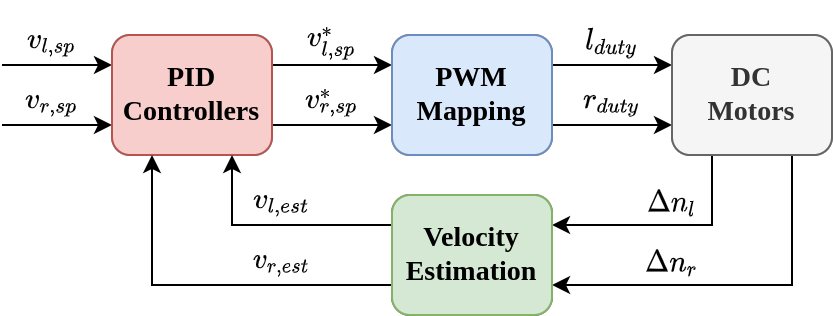
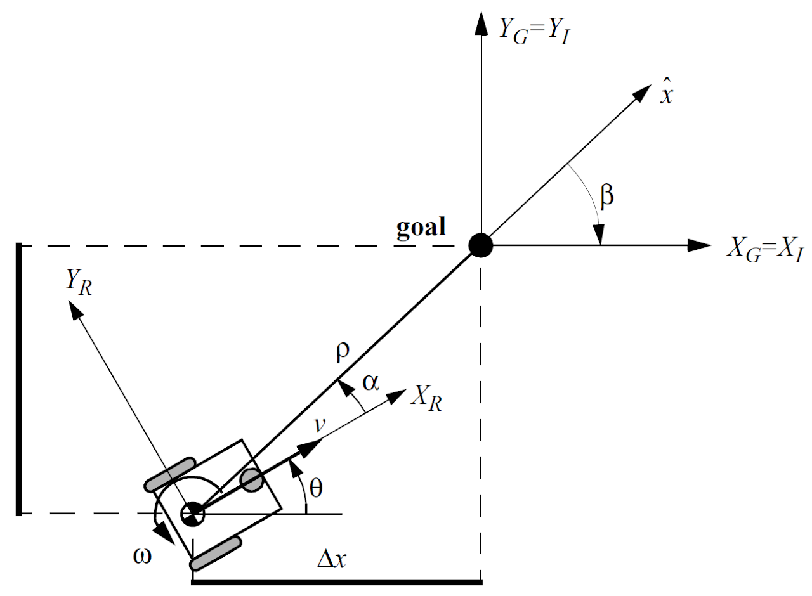
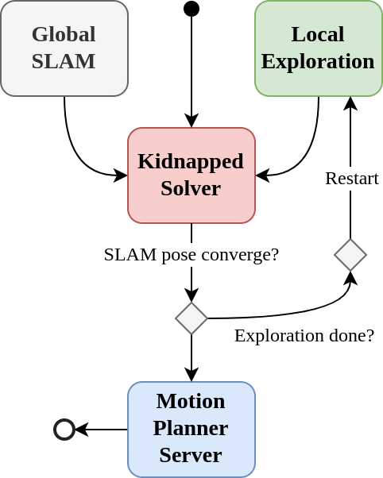

# ROB 550 Botlab

This was a group project completed as part of the ROB 550 course at the University of Michigan, Ann Arbor, undertaken in Fall 2023 as part of the MS Robotics curriculum. In the Botlab, we developed movement control, obstacle detection, maze exploration, and self-localization capabilities on the MBot mobile robot platform. The project focused on exploring the fundamentals of robotic autonomy by enabling the MBot to perform autonomous mapping, localization, and environment exploration. This repository contains the updated and final version of the original codebase.

<!--   -->

      

<table>
<tr>
<td>
  
## System setup and Preliminaries
- [Set up Jetson Nano System](https://drive.google.com/file/d/1snBIfBYC1WnWeXmGDQzVPnzadDBNNSKM/view?usp=sharing)  
- [Update System Utilities](https://drive.google.com/file/d/1JjxOLtd89kO1biE8RGukBOlJu6GlabRv/view?usp=sharing)
- [Set up MBot firmware](https://drive.google.com/file/d/1uhqe8_y8aP5RM1-PqLhodTnwgl3P1jzo/view?usp=sharing)
- [Install the rest of the MBot Code](https://drive.google.com/file/d/1TBajTu7aj07esqkXXomnzD3DQJbb_Vxi/view?usp=sharing)
- Mbot Classic - [Assembly Guide](https://drive.google.com/file/d/1bMIMllZoNJKQFQE2biEq9hPVck_DhmAd/view?usp=sharing)
- microSD card for main storage
- SD adapter
- On the right is the software schematic:

</td>
<td>

</td>
</tr>
</table>

## Simultaneous Localization and Mapping (SLAM)
A SLAM system was implemented in line with the ROB 550 BotLab curriculum at the University of Michigan, which emphasizes full-stack autonomy through sensing, reasoning, and acting on mobile robotic platforms such as the MBot. The system combines occupancy-grid mapping with Monte Carlo Localization (MCL) to jointly estimate both the robot’s pose and the environment map in real time. It integrates a motion (action) model, sensor model, and particle filter to account for uncertainty in robot dynamics and noisy LIDAR/IMU measurements, consistent with the course’s focus on probabilistic robotics and state estimation.

At each timestep, the SLAM module maintains a probabilistic occupancy grid while also producing a single robust pose estimate. To improve robustness against outliers and particle degeneration, only the top 10% highest-weighted particles are selected, and their likelihood-weighted mean is computed to produce the final pose estimate used for navigation and exploration tasks such as maze solving and autonomous mapping.

   

 

## Motion Controller

The MBot motion control system is implemented as a layered hierarchy that translates high-level navigation goals into low-level motor commands while respecting the nonholonomic constraints of a differential-drive robot.

At the highest level, the controller receives a sequence of waypoints and generates corresponding velocity commands to follow the desired trajectory. A nonholonomic state feedback controller computes the required linear and angular velocities by reducing positional errors in the robot’s x–y plane and heading direction, ensuring smooth convergence toward the target path.

These velocity commands are then mapped into individual wheel velocity targets using differential-drive kinematics. At the lowest level, each wheel is controlled by an independent PID controller that tracks its reference speed by adjusting PWM duty cycles sent to the motor drivers. This combines a feedforward duty-cycle mapping with feedback correction to handle motor nonlinearities, slip, and external disturbances.

Together, this multi-layer control architecture enables accurate trajectory tracking, stable motion execution, and robust low-level actuation on the MBot platform.

- **Velocity and Motion controller schematic**:
 
  

 
 

- **Wheel controller schematic (left) and Non-holonomic representative sketch (right)**:
     

## Planning and Exploration
Planning and exploration are the top level functions that use SLAM and motion control. A* is used for path planning and the controller follows these paths to explore the environment. The system selects the nearest frontier defined as unknown areas next to known free space and plans routes toward its center to systematically map unexplored regions.

  

This demo video shows a solution to the global localization problem, where the global map is given but the robot starts at a unknown initial pose. 

https://user-images.githubusercontent.com/44640904/212575563-97fcfa00-b8ad-47fc-a2c0-fd5095b8317b.mp4
